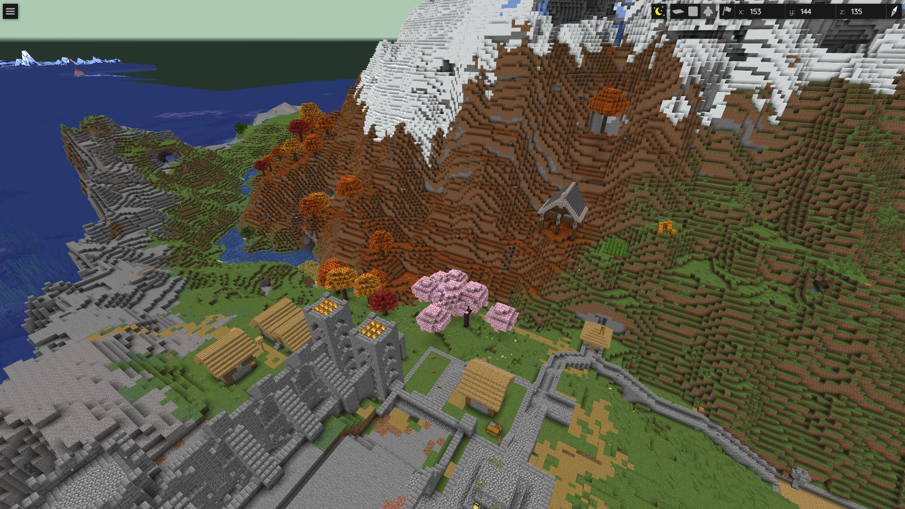
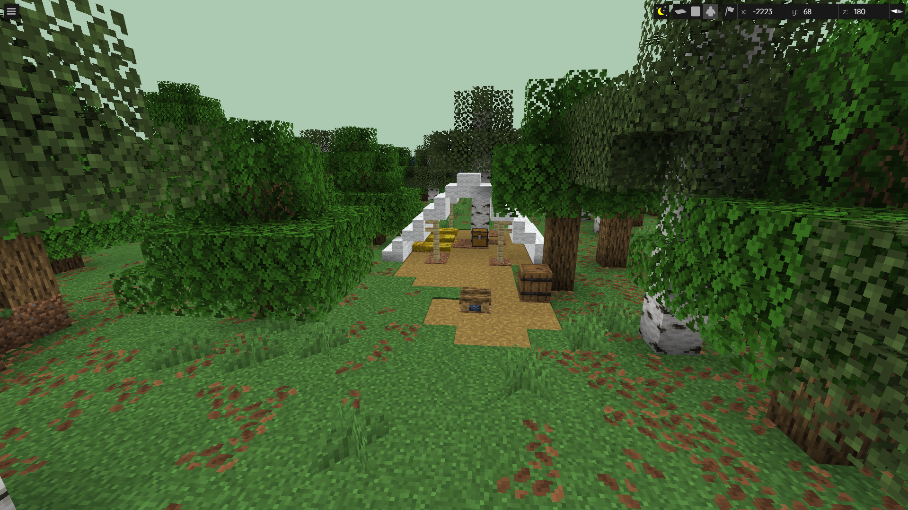

# Minecraft 26.3-pre-2 palette compatibility investigation

## Scope and status

Submitted for maintainer discussion in the official BlueMap [suggestions topic](https://discord.com/channels/665868367416131594/1546329678875336754). See [submission record](SUBMISSION.md). No native patch has been submitted or accepted.

This is a compatibility investigation for **BlueMap CLI 5.23** with a **Vanilla Java Edition 26.3-pre-2** world and matching client resources. The observed rendering ran on Linux ARM64 with Java 25. No world-generation mods were used. This is prerelease-version support, not a claim of a regression within BlueMap's advertised supported versions.

On 2026-09-07 UTC, the latest published release was v5.23. Upstream `master` at `9c4efeb9696eaae979ec70ea11de8be30e7d2a53` still expects a compound containing `Name` and optional `Properties` in [BlockStateDeserializer.java](https://github.com/BlueMap-Minecraft/BlueMap/blob/9c4efeb9696eaae979ec70ea11de8be30e7d2a53/core/src/main/java/de/bluecolored/bluemap/core/world/mca/data/BlockStateDeserializer.java). That source inspection does not substitute for a full build/render test of master. Searches for 26.3 in existing issues and PRs did not find a matching report at the time of review.

The investigation and documentation were prepared with AI assistance. No native Java patch is proposed here. BlueMap's [contribution guidelines](https://github.com/BlueMap-Minecraft/BlueMap/blob/master/.github/CONTRIBUTING.md) request prior Discord discussion for new features and disallow primarily AI-generated code contributions. The intended submission is a scoped compatibility report to that discussion channel, rather than an unsolicited code PR.

## Observations

The world data encountered during the investigation included compact string palette entries and compound entries using `id`/`properties`. Heterogeneous-list handling also exposed wrapped string entries under an empty key. Default block-state properties can be omitted. Merely converting identifier field names was insufficient: some blocks remained invisible and distant simplified geometry could look distorted.

The compatibility workaround used an isolated copy of the world and:

1. Converted string entries to legacy `Name` plus parsed explicit `Properties`.
2. Converted `id`/`properties` and empty-key wrappers to the legacy compound representation.
3. Filled omitted properties from the **default state in the exact version's generated `reports/blocks.json`**.
4. Applied explicit saved properties over those defaults.
5. Preserved palette order and packed indices, then rebuilt the map with matching client resources.

The original world was not modified. No Minecraft JAR, registry dump, private world, player data, raw log, hostname, or infrastructure configuration is distributed with this evidence package. The original deployment-specific converter is not included; `normalize.py` is a small standalone illustration of its state-normalization rule.

## Minimal data cases

The following are illustrative JSON representations of NBT shapes, not a complete world fixture. `example:*` identifiers and default properties are synthetic.

| Input shape | Required handling |
|---|---|
| `"example:log"` | Read the identifier and supply the version-specific default state |
| `"example:log[axis=x]"` | Preserve explicit `axis=x` |
| `{"id":"example:leaves","properties":{"persistent":"true"}}` | Rename fields, fill omitted defaults, retain the explicit property |
| `{"":"example:log"}` | Handle the wrapped-string representation when exposed by the list decoder |
| `{"Name":"example:log","Properties":{"axis":"z"}}` | Preserve legacy behavior |

Run the dependency-free synthetic checks with Python 3.12+:

```sh
python docs/bluemap-26.3/normalize.py
```

These checks cover state shapes, precedence, idempotence, and unchanged inputs. They do **not** execute BlueMap's Java deserializer or prove full 26.3 compatibility. A native implementation still needs real NBT deserialization tests, matching-version default-state acquisition, and regression coverage for older worlds. Do not infer defaults from whichever model variant appears first.

## Visual evidence after the workaround

The following images were supplied by the world owner and are included unchanged with permission for this contribution. They show rendering **after** external normalization; they are not evidence of native support in unmodified BlueMap. They contain only the map view and in-game coordinates. The before/after observations were not captured as a controlled identical-camera benchmark.

### Dappled Forest landscape



The owner identified this scene as Dappled Forest. The foreground shows detailed terrain and foliage. The image also contains incomplete distant map coverage; it should not be interpreted as a claim that every visible boundary or distant artifact is fixed. Incomplete render queues and old render masks are separate from block-state compatibility and are outside this report's scope.

### Campsite and straw bed



The owner identified the visible yellow bedding as the new straw bed. This illustrates additional 26.3 content in the same adapted rendering path. The screenshot alone does not validate every orientation or multipart state of that block.

## Recommended upstream investigation

- Recognize compact and compound state forms at the NBT decoding boundary, including heterogeneous list behavior.
- Resolve omitted properties against the correct Minecraft version's defaults before model condition matching.
- Keep legacy compound decoding and explicit property precedence unchanged.
- Add focused tests for omitted defaults, explicit overrides, mixed palettes, and legacy data.
- Validate against newly generated 26.3 test terrain and its matching client resources before advertising support.

This report intentionally excludes website deployment, chat, server administration, rendering-queue tuning, and storage management.
